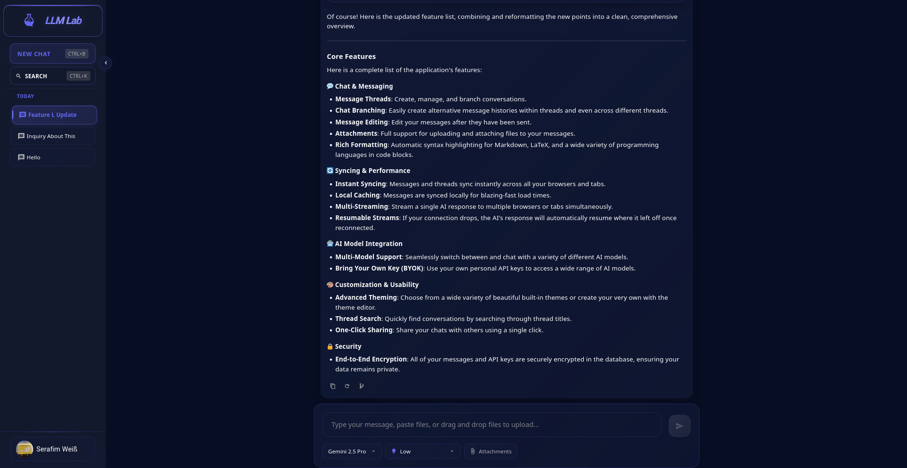

# TRY A LIVE DEMO HERE: https://llmlab.chat



## LLMLab

This project is a web-based application for interacting with large language models (LLMs). It allows users to create and manage message threads, send messages, and receive responses from different AI models.

This project was written for the T3 Chat Cloneathon https://t3.gg/chat-cloneathon

## Features

Of course! Here is the updated feature list, combining and reformatting the new points into a clean, comprehensive overview.

***

### Core Features

Here is a complete list of the application's features:

#### 💬 Chat & Messaging
*   **Message Threads**: Create, manage, and branch conversations.
*   **Chat Branching**: Easily create alternative message histories within threads and even across different threads.
*   **Message Editing**: Edit your messages after they have been sent.
*   **Attachments**: Full support for uploading and attaching files to your messages, including pasting attachments directly from your clipboard and drag-and-drop support.
*   **Rich Formatting**: Automatic syntax highlighting for Markdown, LaTeX, and a wide variety of programming languages in code blocks.

#### 🔄 Syncing & Performance
*   **Instant Syncing**: Messages and threads sync instantly across all your browsers and tabs.
*   **Local Caching**: Messages are synced locally for blazing-fast load times.
*   **Multi-Streaming**: Stream a single AI response to multiple browsers or tabs simultaneously.
*   **Resumable Streams**: If your connection drops, the AI's response will automatically resume where it left off once reconnected.

#### 🤖 AI Model Integration
*   **Multi-Model Support**: Seamlessly switch between and chat with a variety of different AI models.
*   **Bring Your Own Key (BYOK)**: Use your own personal API keys to access a wide range of AI models.

#### 🎨 Customization & Usability
*   **Advanced Theming**: Choose from a wide variety of beautiful built-in themes or create your very own with the theme editor.
*   **Thread Search**: Quickly find conversations by searching through thread titles.
*   **One-Click Sharing**: Share your chats with others using a single click.

#### 🔒 Security
*   **Encryption**: All of your messages and API keys are encrypted in the database.
## Tech Stack

-   **Backend**: ASP.NET Core 9.0, Entity Framework Core, SignalR
-   **Frontend**: Blazor WebAssembly, MudBlazor (used sparingly), plain HTML and CSS
-   **Database**: MSSQL (Dockerized for development using Aspire)

## Running the Project

**Prerequisites:**
*   .NET SDK (version 9.0 or later)
*   WASM Tools (for client-side WebAssembly support: https://learn.microsoft.com/en-us/aspnet/core/blazor/webassembly-build-tools-and-aot?view=aspnetcore-9.0)
*   Docker (for running the MSSQL database)


1.  Clone the repository.
2.  Navigate to the `LLMLab.AppHost` directory.
3.  Run the command `dotnet run`.

This will start the application, including the database, server, and client.

4.  Open your web browser and navigate to `http://localhost:5000` to access the application.

## Publishing the Project

To deploy the project, you need to publish the `LLMLab.Server` and `LLMLab.ClientWebServer` projects.

1.  Publish the server:
    ```bash
    dotnet publish -c Release
    ```
2.  Publish the client project:
    ```bash
    dotnet publish -c Release
    ```
You can add the -o option to specify the output directory for the published files:
    ```bash
    dotnet publish LLMLab.Client -c Release -o ./publish
    ```
3.  (Optional) If you don't have a Server to host the client files, you can use the `LLMLab.ClientWebServer` project to serve the client files. Publish it as well:
    ```bash
    dotnet publish -c Release
    ```
    Then merge the directories of the Client and ClientWebServer


## Configuring the Project
1. You have to configure the `appsettings.Production.json` file in the `LLMLab.Server` project to set up your database connection string and other settings. Here is an example configuration:
```json
{
  "ConnectionStrings": {
    "DefaultConnection": "***"
  },
  "Logging": {
    "LogLevel": {
      "Default": "Information",
      "Microsoft": "Warning",
      "Microsoft.Hosting.Lifetime": "Information"
    }
  },
  "AppSettings": {
    "ClientUrl": "http://llmlab.chat",
    "ClientAfterLoginPath": "/afterLogin",
    "CookieDomain": ".llmlab.chat",
    "AllowedOrigins": [
      "https://llmlab.chat",
      "https://login.llmlab.chat"
    ],
    "EncryptionKey": "mu8Q97mF2jYiAZc8AfdK1w=="
  },
  "Authentication": {
    "Google": {
      "ClientId": "***",
      "ClientSecret": "***"
    }
  },
  "Mailgun": {
    "ApiKey": "***",
    "Domain": "mail.llmlab.chat",
    "From": "LLM Lab noreply@mail.llmlab.chat"
  }
}
```

Generate the EncryptionKey here https://generate-random.org/encryption-key-generator?count=1&bytes=8&cipher=aes-128-cbc&string=&password=

2. You also need to configure the `appsettings.json` file in the `LLMLab.Client` project to set up the client URL and other settings. Here is an example configuration:
```json
{
  "ServerUrl": "https://login.llmlab.chat"
}
```
On the Client project, you have to do this for every deployment. The Server project only has to be configured once.

## Hosting the Published Files

You can then deploy the published artifacts to your hosting environment

1. Deploy the `LLMLab.Server` to your server environment and run it using this command:
    ```bash
    dotnet LLMLab.Server.dll --environment Production
    ```
2. Deploy the `LLMLab.ClientWebServer` to your server environment and run it using this command:
    ```bash
    dotnet LLMLab.ClientWebServer.dll --environment Production
    ```

## Database Model


There are also some Tables related to ASP.NET Core Identity and Hangfire, but they are managed by libraries.

## Sync Models

The application uses SignalR for real-time communication between the server and client. The following models are used for synchronization:

### Message Threads


### Message Streaming


### Settings

Settings are not synchronized or stored on the server. They use a key-value store in the browser (localStorage) to persist the settings across sessions.